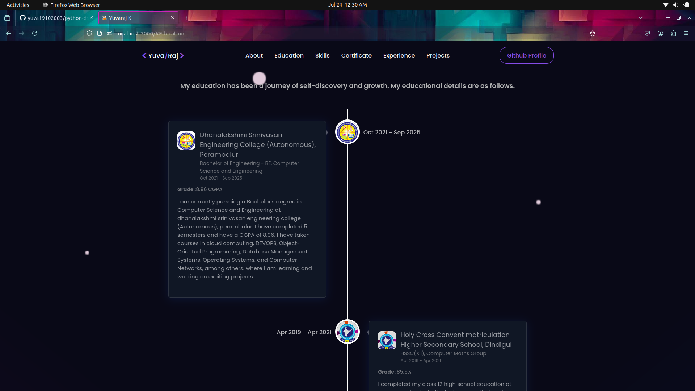
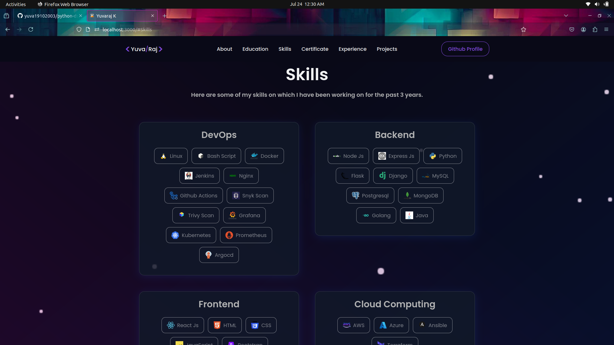
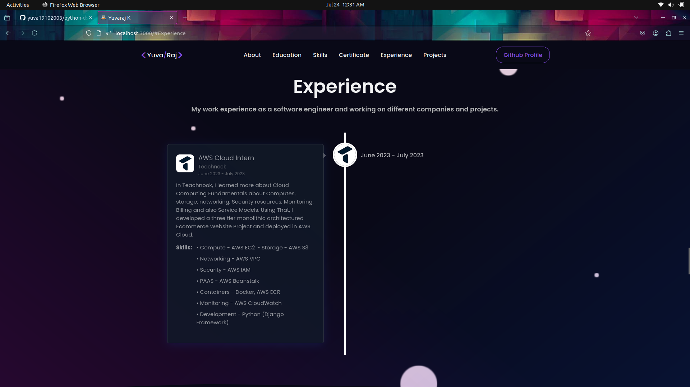
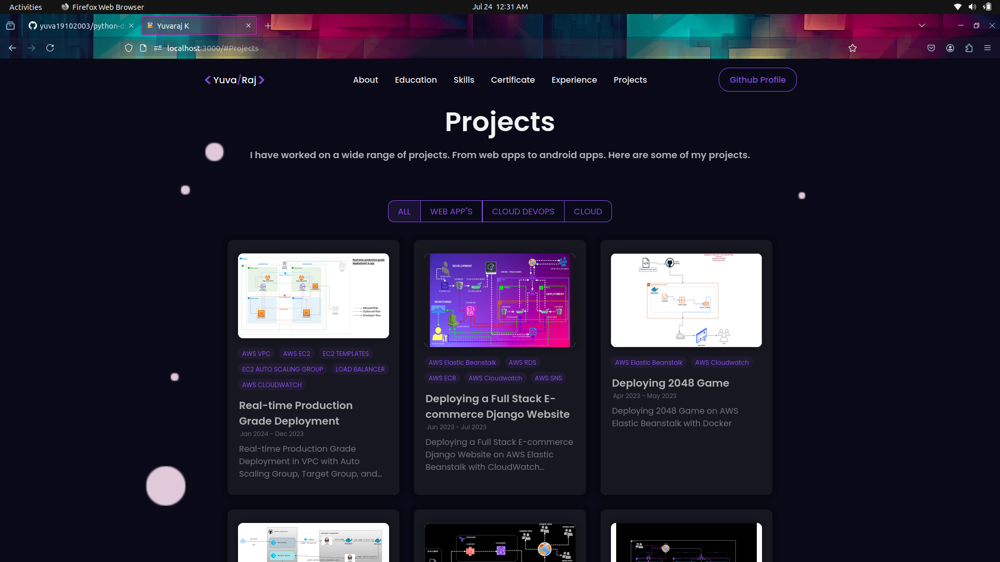
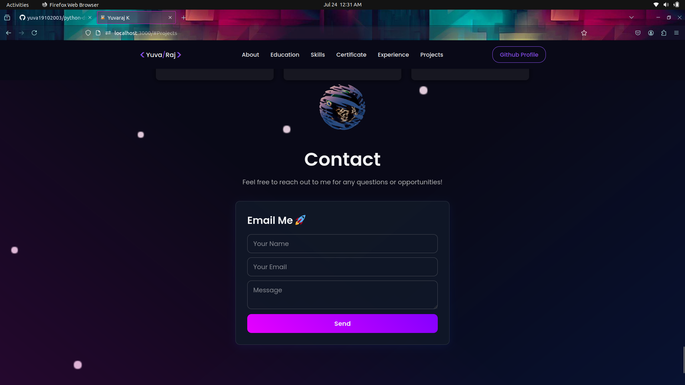

# React-Portfolio

## Screenshots

### HOME


### EDUCATIONS


### SKILLS


### CERTIFICATES


### EXPERIENCE


### PROJECTS


### CONTACT


---
## Deployed in github pages

on GitHub, where we are going to host our application. 

#### Install the gh-pages dependency using npm :

```
npm install gh-pages --save-dev
```

#### Adding the properties to the package.json file

The package.json file is been configured so that we can point the GitHub repository to where our react app is been deployed. The first property we have to add is at the top of the package.json file which will be given the name `homepage`, and the value for it will be in the following format:

```
"homepage": "https://<Username>.github.io/<Repository-name>"
```

`Example: homepage: “https://vishalWaghmode.github.io/Textutil”`


#### Then we will add 1deploy` and `predeploy` properties in the script field with the following values:

```
"scripts":{
    "predeploy": "npm run build",
    "deploy": "gh-pages -d build" 
}  
``` 
#### Pushing the code updates to the GitHub repository and finally deploying the application
For pushing the updates which we have done in the code we can use the following commands:

```
git add .
git commit -m "commit"
git push
```

#### And now finally deploy the application using the following command in the terminal:

```
npm run deploy
```
This command will publish your application on the branch named gh-pages and can be opened by the link given in the homepage property written in the package.json file.

`View the deployed app on GitHub`

Now, to view the link for opening the application we will go on the GitHub and click on Settings then at the left of the settings we can see the code and automation where the pages field will be present, just clicking it we will get the following interface where the link will be provided.

